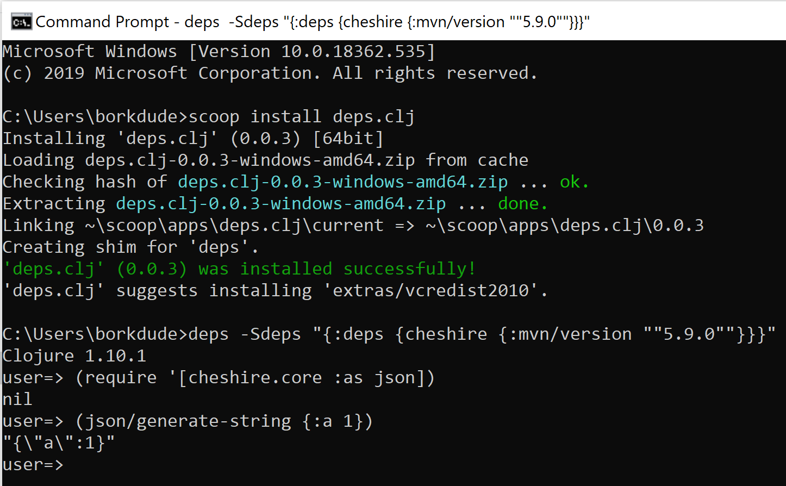

# deps.clj

[](https://circleci.com/gh/borkdude/deps.clj/tree/master)
[](https://ci.appveyor.com/project/borkdude/deps.clj/branch/master)
[](https://clojars.org/borkdude/deps.clj)

## About

A faithful port of the Clojure CLI bash script to Clojure. Used as native
CLI, deps resolver in babashka, and getting started REPL in Calva.

Clojure provides the [`clojure`](https://clojure.org/guides/deps_and_cli)
command line tool for:

- Running an interactive REPL (Read-Eval-Print Loop)
- Running Clojure programs
- Evaluating Clojure expressions

The `clojure` CLI is written in bash. This is a port of that tool written in
Clojure itself.

## Features

- Run as executable compiled with [GraalVM](https://github.com/oracle/graal)
  Or run directly from source with [babashka](https://github.com/babashka/babashka/) or the JVM
- Similar startup to bash (with native or babashka)
- Easy installation on all three major platforms including Windows
- Works in `cmd.exe` on Windows

## Quickstart

Linux and macOS:

``` shell
$ curl -sL https://raw.githubusercontent.com/borkdude/deps.clj/master/install > install_clojure
$ chmod +x ./install_clojure
$ ./install_clojure # you may need sudo, depending on your system
$ deps
Clojure 1.10.1
user=>
```

Windows:

``` shell
C:\Temp> PowerShell -Command "irm https://raw.githubusercontent.com/borkdude/deps.clj/master/install.ps1" > install_clojure.ps1
C:\Temp> PowerShell -f install_clojure.ps1
C:\> deps.exe
Clojure 1.10.1
user=>
```

To install `deps` / `deps.exe` as `clojure` / `clojure.exe` on your system, add
the `--as-clj` flag:

``` shell
$ ./install_clojure --as-clj
```

If your Windows system does not run PowerShell, you can simply download a
Windows binary from [Github
releases](https://github.com/borkdude/deps.clj/releases) and place it on your
path.

As of 1.11.1.1165, the scripts passes the values of the `CLJ_JVM_OPTS`
or `JAVA_OPTIONS` to `java` when downloading dependencies or executing
all other commands respectively (useful for setting up network
connectivity behind firewalls).

## Why

Originally this project was created as a proof of concept to see if the
`clojure` bash script could be ported to Clojure and be used as a
[babashka](https://github.com/babashka/babashka/) script.

Nowadays it is used as the code behind the `babashka.deps` namespace and the
`clojure` subcommand in babashka, to resolve and download dependencies for
babashka itself, or when running a Clojure process with babashka.

This project offers an arguably easier way to get going with `deps.edn` based
projects in CI. Just download an installer script, execute it with bash or
Powershell and you're set. Installer scripts are provided for linux, macOS and
Windows.

Windows users might find the `deps.exe` executable of value if they have trouble
getting their system up and running. It works with `cmd.exe` unlike the current
Powershell based approach.

## Projects using deps.clj

### [Babashka](https://github.com/babashka/babashka)

Available under the `clojure` subcommand. It is also available as
a programmatic API under `babashka.deps`.

### [Calva](https://github.com/BetterThanTomorrow/calva)

Used to provide a getting started REPL.

## Status

Deps.clj tries to follow the official Clojure CLI as faithfully as possible and
as such, this project can be considered a stable drop-in
replacement. Experimental [extra
options](https://github.com/borkdude/deps.clj#extra-features) may still be
changed or removed in the future.

## Installation

There are three ways of running:

- As a compiled binary called `deps` which is tailored to your OS.
- From source, as a script file called `deps.clj` using the [`bb`](https://github.com/babashka/babashka/) or `clojure` runtime.
- As a JVM library or uberjar (see [Github
releases](https://github.com/borkdude/deps.clj/releases)).

### Binary

The binary version of deps.clj, called `deps` (without the `.clj` extension), only requires a working
installation of `java`.

#### Manual download

Binaries for linux, macOS and Windows can be obtained on the [Github
releases](https://github.com/borkdude/deps.clj/releases) page.

#### Linux and macOS

``` shell
$ curl -sL https://raw.githubusercontent.com/borkdude/deps.clj/master/install > install_clojure
$ chmod +x ./install_clojure
$ ./install_clojure # you may need sudo, depending on your system
$ deps
Clojure 1.10.1
user=>
```

#### Windows

On Windows you might want to install `deps.clj` using
[scoop](https://github.com/littleli/scoop-clojure).

To install deps.clj as a _replacement_ for the `clj` command, install `clj-deps`:

``` shell
scoop bucket add scoop-clojure https://github.com/littleli/scoop-clojure
scoop install clj-deps
```

Alternatively you can install `deps.exe` using by executing the following line:

``` shell
C:\Temp> PowerShell -Command "irm https://raw.githubusercontent.com/borkdude/deps.clj/master/install.ps1" > install_clojure.ps1
C:\Temp> PowerShell -f install_clojure.ps1
C:\> deps.exe
Clojure 1.10.1
user=>
```

It's automatically added to your path. In Powershell you can use it right
away. In `cmd.exe` you'll have to restart the session for it to become available
on the path.

When you get a message about a missing `MSVCR100.dll`, also install the
[Microsoft Visual C++ 2010 Redistributable Package
(x64)](https://www.microsoft.com/en-us/download/details.aspx?id=14632) which is
also available in the
[extras](https://github.com/lukesampson/scoop-extras/blob/master/bucket/vcredist2010.json)
Scoop bucket.



##### clj-msi

If you're interested in installing deps.clj as `clj.exe` and `clojure.exe` via
an MSI installer, take a look at [clj-msi](https://github.com/casselc/clj-msi)!

### Script

The script, `deps.clj`, requires a working installation of `java` and
additionally [`bb`](https://github.com/babashka/babashka/) or `clojure`.

It can simply be downloaded from this repo:

``` shell
$ curl -sL https://raw.githubusercontent.com/borkdude/deps.clj/master/deps.clj -o /tmp/deps.clj
$ chmod +x /tmp/deps.clj
$ bb /tmp/deps.clj
Clojure 1.10.1
user=>
```

On Windows you can use the `deps.bat` script:

``` shell
C:\Temp> curl -sL https://raw.githubusercontent.com/borkdude/deps.clj/master/deps.bat -o c:\Temp\deps.bat
C:\Temp> deps
C:\Temp>
Clojure 1.10.1
user=>
```

### Environment variables

#### DEPS_CLJ_TOOLS_DIR

This project will look in `$HOME/.deps.clj/<clojure-version>/ClojureTools` for
`clojure-tools-<clojure-version>.jar`, `exec.jar` and `example-deps.edn`. If it
cannot it find those files there, it will try to download them from
[this](https://download.clojure.org/install/clojure-tools-1.10.1.697.zip)
location invoking `java` using the value of the `CLJ_JVM_OPTS` environment variable as options.
You can override the location of these jars with the `DEPS_CLJ_TOOLS_DIR` environment variable.
If the download fails for some reason, you can try to download the zip yourself at the location
suggested by the failure message.

If you have an already installed version of clojure using e.g. brew, you can set
`DEPS_CLJ_TOOLS_DIR` to that directory:


#### DEPS_CLJ_TOOLS_VERSION

This project assumes a specific version of the tools jar. However, it can be
desirable to up- or downgrade the targetted tools jar in case of bug fixes or
bugs in newer versions. Be aware that the code of this project is written with a
specific version of the tools jar in mind, so use this at your own risk. Given
that there isn't a lot of churn in the bash code that this project replaces, the
risk should be relatively low.

## Extra features

The `deps.clj` script adds the following features compared to the `clojure`
tool:

```
 -Sdeps-file    Use this file instead of deps.edn
 -Scommand      A custom command that will be invoked. Substitutions: {{classpath}}, {{main-opts}}.
```

It also is able to pick up [proxy information from environment
variables](#proxy-environment-variables).

### -Scommand

One of the use cases for `deps.clj` is invoking a different command than `java`.

Given this `deps.edn`:

``` clojure
{:aliases
 {:test
  {:extra-paths ["test"]
   :extra-deps {borkdude/spartan.test {:mvn/version "0.0.4"}}
   :main-opts ["-m" "spartan.test" "-n" "borkdude.deps-test"]}}}
```

you can invoke [`bb`](https://github.com/babashka/babashka/) like this:

``` shell
$ deps.clj -A:test -Scommand "bb -cp {{classpath}} {{main-opts}}"
Ran 3 tests containing 3 assertions.
0 failures, 0 errors.
```

If you use `-Scommand` often, an alias can be helpful:

``` shell
$ alias bbk='rlwrap deps.clj -Scommand "bb -cp {{classpath}} {{main-opts}}"'
$ bbk -A:test
Ran 3 tests containing 3 assertions.
0 failures, 0 errors.
```

The `bbk` alias is similar to the `clj` alias in that it adds `rlwrap`.

Additional args are passed along to the command:

``` shell
$ bbk -e '(+ 1 2 3)'
6
```

Of course you can create another alias without `rlwrap` for CI, similar to the
`clojure` command:

``` shell
$ alias babashka='deps.clj -Scommand "bb -cp {{classpath}} {{main-opts}}"'
```

This approach can also be used with [planck](https://github.com/planck-repl/planck) or
[lumo](https://github.com/anmonteiro/lumo):

``` shell
$ alias lm='deps.clj -Scommand "lumo -c {{classpath}} {{main-opts}}"'
$ lm -Sdeps '{:deps {medley {:mvn/version "1.2.0"}}}' -K \
  -e "(require '[medley.core :refer [index-by]]) (index-by :id [{:id 1} {:id 2}])"
{1 {:id 1}, 2 {:id 2}}
```

### -Sdeps-file

The  `-Sdeps-file` option may be used to load a different project file than `deps.edn`.

### Proxy environment variables

deps.clj supports setting a proxy server via the "standard" environment variables (the lowercase versions are tried first):
- `http_proxy` or `HTTP_PROXY` for http traffic
- `https_proxy` or `HTTPs_PROXY` for https traffic

This will set the JVM properties `-Dhttp[s].proxyHost` and `-Dhttp[s].proxyPort`.

The format of the proxy string supported is `http[s]://[username:password@]host:port`. Any username and password info is ignored as not supported by the underlying JVM properties.

## API

Since version `1.11.1.1273-2`, deps.clj exposes an API so it can be embedded in
applications, rather than just using it from the command line directly.

See [API.md](API.md) docs.

E.g to parse CLI options:

``` clojure
(require '[borkdude.deps :as deps])
(deps/parse-cli-opts ["-M" "-m" "foo.bar"])
;;=> {:mode :main, :main-aliases nil, :args ("-m" "foo.bar")}
```

Re-binding the `*aux-process-fn*`, used for calculating the classpath, pom etc
and `*clojure-process-fn*`, used for creating the actual Clojure process, gives
you more control during the "shelling out" parts of `deps.clj`.

``` shell
$ clj -Sdeps '{:deps {babashka/process {:mvn/version "0.5.19"}}}'
```

``` clojure
(require '[babashka.process :as p] '[borkdude.deps :as deps])

(defn my-aux-process [{:keys [cmd out]}]
  (binding [*out* *err*]
    (apply println "Calling aux process with cmd:" cmd))
  (p/shell {:cmd cmd :out out :extra-env {"GITLIBS" "/tmp/gitlibs"}}))

(defn my-clojure-process [{:keys [cmd out]}]
  (binding [*out* *err*]
    (apply println "Calling Clojure with command:" cmd))
  (p/shell {:cmd cmd :out *out* :extra-env {"FOO" "BAR"}}))

(binding [deps/*aux-process-fn* my-aux-process
          deps/*clojure-process-fn* my-clojure-process]
  (with-out-str (deps/-main "-Sforce" "-M" "-e" (pr-str '(System/getenv "FOO")))))

;;=>
Calling aux process with cmd: /usr/bin/java -XX:-OmitStackTraceInFastThrow -classpath ... -e (System/getenv "FOO")
"\"BAR\"\n"
```

Note that you should handle the exit codes yourself when implementing your own
`-process-fn`. If you don't do that, then `*exit-fn*` will be called, which
defaults to exiting the process if the `:exit` code was non-zero. To prevent
this, you can re-bind `*exit-fn*` to throwing an exception instead:

Without re-binding `*exit-fn*`:

``` clojure
user=> (require '[borkdude.deps :as deps])
nil
user=> (deps/-main "-M" "-e" "(/ 1 0)")
Execution error (ArithmeticException) at user/eval1 (REPL:1).
Divide by zero

Full report at:
/var/folders/j9/xmjlcym958b1fr0npsp9msvh0000gn/T/clojure-8365878068735118865.edn
```

``` clojure
user=> (binding [deps/*exit-fn* (fn [{:keys [exit message]}] (println "Exit code:" exit))] (deps/-main "-M" "-e" "(/ 1 0)"))
Execution error (ArithmeticException) at user/eval1 (REPL:1).
Divide by zero

Full report at:
/var/folders/j9/xmjlcym958b1fr0npsp9msvh0000gn/T/clojure-2500586512812528128.edn
Exit code: 1
{:out nil, :exit 1}
user=> ;; we're still in the REPL
```

## Developing deps.clj

For running locally, you can invoke deps.clj with `clojure` (totally meta
right?). E.g. for creating a classpath with deps.clj, you can run:

```
$ clojure -M -m borkdude.deps -Spath
```

or with `lein`:

```
$ lein run -m borkdude.deps -Spath
```

To run jvm tests:

```
$ bb jvm-test
```

To run with babashka after making changes to `src/borkdude/deps.clj`, you should run:

```
$ bb gen-script
```

and then:

```
$ ./deps.clj -Spath
# or
$ bb deps.clj -Spath
```

To run as an executable, you'll first have to compile it. First,
[download](https://github.com/graalvm/graalvm-ce-builds/releases) a GraalVM
distro. The compile script assumes that you will have set `GRAALVM_HOME` to the
location of your GraalVM installation. Currently this project uses `java-11-20.1.0`.

``` shell
$ export GRAALVM_HOME=/Users/borkdude/Downloads/graalvm-ce-java11-20.1.0/Contents/Home
```

The script also assumes that you have
[`lein`](https://github.com/technomancy/leiningen) installed.

Run the compile script with:

```
$ bb compile
```

If everything worked out, there will be a `deps` binary in the root of the
project.

To run executable tests:

```
$ bb exe-test
```

## License

Copyright © 2019-2020 Michiel Borkent

Distributed under the EPL License. See LICENSE.

This project is based on code from
[clojure/brew-install](https://github.com/clojure/brew-install/) which is
licensed under the same EPL License.
